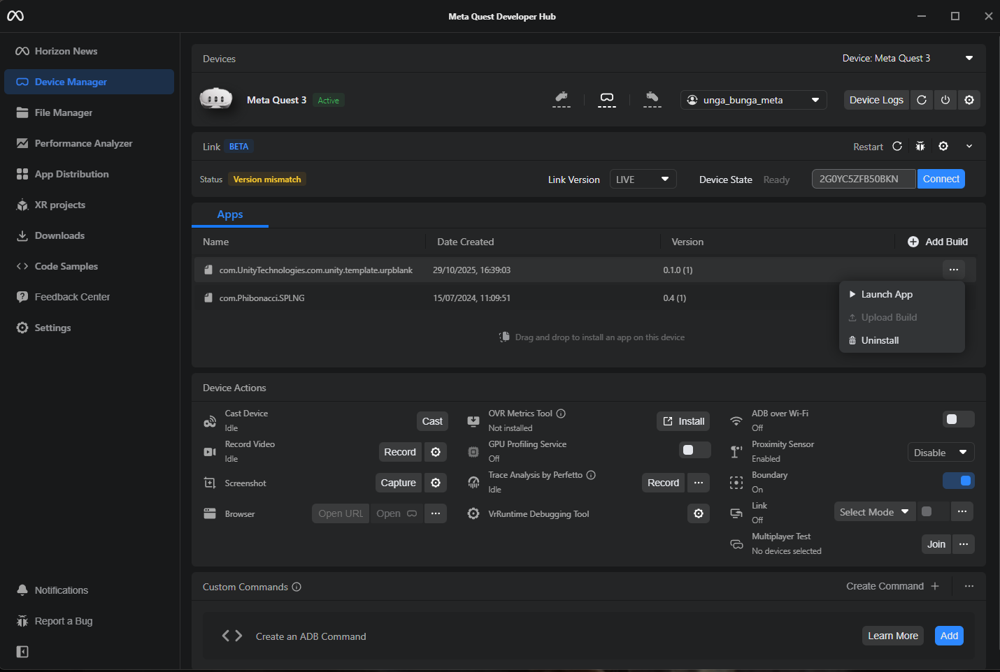

# Jewelry Shop Robbery - Meta Quest (Hand Tracking)

This repo hosts the download link and setup instructions for installing and playing the Jewelry Shop Robbery VR game on Meta Quest via an APK.

**Download (APK in ZIP)**
- Google Drive: https://drive.google.com/file/d/1wzPYhbF4e4michA_ayBq3FJlH_rcbSgt/view?usp=sharing
- Download the ZIP and extract the `.apk` file inside.

**Requirements**
- A Meta Quest headset (Quest 2/3/Pro).
- A Meta developer account (free) and Developer Mode enabled for your headset.
- A Windows/macOS computer with the Meta Quest Developer Hub (MQDH) installed.

**First-Time Setup**
- Create a developer account: https://developer.oculus.com/manage/organizations/
- Enable Developer Mode for your headset in the Meta Quest mobile app:
  - Open the Meta Quest app on your phone -> `Devices` -> select your headset -> `Developer Mode` -> toggle `On`.
- Install Meta Quest Developer Hub: https://developer.oculus.com/meta-quest-developer-hub/

**Install with Meta Quest Developer Hub**
- Connect the headset to your computer with a USB-C cable.
- Put on the headset and accept prompts:
  - "Allow data access?" -> `Allow`.
  - "Allow USB debugging?" -> `Always allow from this computer` -> `OK`.
- Open MQDH; your device should show as `Active`.
- Drag and drop the extracted `.apk` into the `Apps` list in MQDH, or click `Add Build` and select the APK.
- After installation, click the three-dot menu next to the app and choose `Launch App` to start it, or launch from the headset under `Apps` -> `Unknown Sources`.

#### Screenshot

**Demo Video**
- Watch: [Watch the demo video](https://github.com/sawyairhtet/Jewelry-Shop-Robbery-game-with-Meta-Quest-hand-tracking/raw/main/assets/demo.mp4)
- Optional inline player (use a raw URL so GitHub serves the file, not the HTML "blob" page):

  <video src="https://github.com/sawyairhtet/Jewelry-Shop-Robbery-game-with-Meta-Quest-hand-tracking/raw/main/assets/demo.mp4" controls width="800"></video>

  - If using YouTube/Drive, keep the link above and replace the URL with your video link. Optionally add a thumbnail that links to the video: ``
  - If you attach an MP4 to a GitHub Release, replace the `src` with the release asset URL.
  - Large videos should use GitHub Releases or YouTube; avoid committing >100MB files unless using Git LFS.
**Updating or Uninstalling**
- To update, install a newer APK the same way; MQDH will replace the existing build.
- To remove, use the three-dot menu in MQDH -> `Uninstall`, or uninstall from the headset.

**Troubleshooting**
- Device not showing in MQDH:
  - Ensure Developer Mode is enabled and the headset is awake/unlocked.
  - Reconnect the USB-C cable and re-accept the `USB debugging` prompt.
  - Try a different USB port/cable or restart MQDH and the headset.
- Install button disabled or drag-and-drop fails:
  - Confirm you extracted the APK from the ZIP and are installing the `.apk` file.
  - Remove any older copy of the app from MQDH, then try again.
- Can't find the game on the headset:
  - Check `Apps` -> `Unknown Sources` if not launching directly from MQDH.

**Notes**
- The game uses hand tracking on Meta Quest. Ensure hand tracking is enabled in headset settings if you prefer hands over controllers.
- The APK is distributed outside App Lab; install only if you trust the source.

Enjoy the game! If you run into issues, please open an issue in this repo with your headset model and a brief description.

